# TaskSync Pro – Documentación Completa del Proyecto


## Tabla de Contenido

1. [Inicio del Proyecto](#1-inicio-del-proyecto)
2. [Gestión de Alcance](#2-gestión-de-alcance)
3. [Tecnologías utilizadas](#3-tecnologías-utilizadas)
4. [Descripción del Proyecto](#4-descripción-del-proyecto)
5. [Documentación](#5-documentación)
6. [Estructura del Proyecto](#6-estructura-del-proyecto)
7. [Gestión de Recursos Humanos](#7-gestión-de-recursos-humanos)
8. [Gestión de Interesados](#8-gestión-de-interesados)
9. [Gestión del Tiempo](#9-gestión-del-tiempo)
10. [Gestión de Costos](#10-gestión-de-costos)
11. [Gestión de Adquisiciones](#11-gestión-de-adquisiciones)
12. [Gestión de la Comunicación](#12-gestión-de-la-comunicación)
13. [Gestión de la Calidad](#13-gestión-de-la-calidad)
14. [Gestión de Riesgos](#14-gestión-de-riesgos)
15. [Plan de Pruebas](#15-plan-de-pruebas)
16. [Información del Cierre del Proyecto](#16-información-del-cierre-del-proyecto)
17. [Resultados Finales](#17-resultados-finales)
18. [Presentación del Proyecto](#18-presentacion-del-proyecto)


## 1. Inicio del Proyecto

**Nombre del Proyecto:** TaskSync Pro

**Gerente del Proyecto:** Diego Salvador Tecorralco Martinez

**Fecha de Inicio:** 4 de mayo de 2026

**Fecha Estimada de Cierre:** 17 de agosto de 2026

**Metodología de Desarrollo:** Scrum

**Justificación del Proyecto:**

TaskSync Pro surge como una propuesta para facilitar la organización de actividades personales y profesionales mediante una aplicación de gestión de tareas.

El proyecto busca permitir que los usuarios puedan administrar sus tareas, categorías, fechas, horarios y recordatorios, además de contemplar la consulta y actualización de tareas mediante un dispositivo wearable.

**Objetivos Estratégicos:**

- Facilitar la organización de actividades personales y profesionales.
- Centralizar la gestión de tareas y recordatorios.
- Permitir el acceso rápido a las tareas mediante un dispositivo wearable.
- Mejorar la organización de actividades mediante categorías, fechas y horarios.
- Desarrollar un sistema organizado y funcional mediante una metodología ágil.


## 2. Gestión de Alcance

### Entregables Principales:

- Aplicación principal para la gestión de tareas.
- Aplicación para dispositivo wearable.
- Base de datos.
- Documentación de requisitos.
- Documentación técnica.
- Manual de usuario.
- Plan de pruebas.
- Resultados de pruebas.
- Documentación de riesgos.
- Documentación de comunicación.
- Cronograma del proyecto.
- Estimación de costos.
- Documentación de cierre.

### Criterios de Aceptación:

- Las tareas pueden ser creadas, consultadas, editadas y eliminadas.
- Las tareas pueden organizarse mediante categorías.
- Las tareas pueden contar con fechas y horarios.
- Los recordatorios pueden asociarse a las tareas.
- Las tareas recurrentes pueden ser administradas.
- Las tareas pueden cambiar de estado.
- Las tareas pueden consultarse desde el componente wearable.
- Las tareas pueden marcarse como completadas desde el wearable.
- La información se almacena correctamente.
- La información se mantiene consistente entre los componentes del sistema.
- Las funcionalidades cumplen con los requisitos establecidos.

### Exclusiones:

- No se integrarán sensores biométricos.
- No se utilizará inteligencia artificial para priorización automática.
- No se incluirá geolocalización.
- No se implementarán videollamadas.
- No se implementará mensajería instantánea.
- No se incluirán funcionalidades que no estén relacionadas directamente con la gestión de tareas.


## 3. Tecnologías utilizadas

| Componente | Tecnología |
| ---------- | ---------- |
| Aplicación principal | React Native |
| Backend | Node.js |
| Framework Backend | Express.js |
| Base de Datos | MySQL |
| Autenticación | JWT |
| Contraseñas | bcrypt |
| Validación | express-validator |
| Comunicación en tiempo real | Socket.io |
| Tareas programadas | node-cron |
| Variables de entorno | dotenv |
| Seguridad HTTP | helmet |
| Control de Versiones | Git / GitHub |
| Pruebas de API | Postman |

El proyecto utiliza estas tecnologías de acuerdo con las necesidades funcionales y técnicas definidas durante su desarrollo.


## 4. Descripción del Proyecto

TaskSync Pro es una aplicación de gestión de tareas diseñada para facilitar la organización personal y profesional.

La aplicación permite crear, editar, eliminar y categorizar tareas, asignarles fechas y horarios, configurar recordatorios y administrar tareas recurrentes.

El proyecto contempla además la sincronización de información entre la aplicación principal y un dispositivo wearable, permitiendo consultar y actualizar tareas desde el dispositivo.

### Alcance del Proyecto

TaskSync Pro estará enfocada en la gestión y organización de tareas personales y profesionales mediante una aplicación principal y un componente wearable.

El sistema permitirá a los usuarios administrar sus actividades diarias, configurar recordatorios y visualizar sus pendientes de manera organizada.

El alcance del proyecto incluye:

- Gestión de tareas.
- Gestión de categorías.
- Configuración de recordatorios.
- Administración de fechas límite.
- Asignación de horarios.
- Administración de tareas recurrentes.
- Cambio de estados de las tareas.
- Visualización mediante calendario.
- Sincronización entre componentes.
- Consulta de tareas desde el wearable.
- Actualización del estado de las tareas desde el wearable.
- Administración de usuarios.
- Autenticación.

El sistema no incluirá funcionalidades avanzadas como sensores biométricos, inteligencia artificial, geolocalización, videollamadas o mensajería instantánea.

### Objetivo General

Desarrollar una aplicación de gestión de tareas sincronizada con un dispositivo wearable que permita a los usuarios organizar sus actividades mediante categorías, fechas, horarios y recordatorios.

### Funcionalidades Principales

- **Creación de Tareas:** Los usuarios pueden crear tareas proporcionando la información necesaria para su administración.
- **Edición de Tareas:** Las tareas pueden modificarse cuando sea necesario.
- **Eliminación de Tareas:** Las tareas pueden eliminarse del sistema.
- **Categorías Personalizadas:** Las tareas pueden organizarse mediante categorías.
- **Fechas y Horarios:** Las tareas pueden contar con fechas y horarios específicos.
- **Recordatorios:** Las tareas pueden tener recordatorios asociados.
- **Recurrencias:** El sistema contempla tareas que pueden repetirse de acuerdo con una configuración determinada.
- **Cambio de Estado:** Las tareas pueden cambiar de estado durante su ciclo de vida.
- **Tareas Específicas del Día:** El usuario puede organizar actividades para fechas y horarios determinados.
- **Sincronización entre Dispositivos:** La información de las tareas puede mantenerse sincronizada entre la aplicación principal y el wearable.
- **Marcar Tareas desde el Wearable:** El usuario puede consultar y marcar tareas como completadas desde el dispositivo wearable.
- **Vista de Calendario:** Las tareas pueden visualizarse organizadas por fecha mediante un calendario.
- **Interfaz Sencilla:** La aplicación busca proporcionar una experiencia de uso clara y sencilla.

### Objetivos Específicos

- Permitir la creación, edición y eliminación de tareas.
- Implementar categorías para una mejor organización.
- Configurar recordatorios para las tareas.
- Incorporar fechas y horarios.
- Implementar tareas recurrentes.
- Implementar diferentes estados para las tareas.
- Sincronizar la información entre la aplicación principal y el wearable.
- Permitir marcar tareas como completadas desde el wearable.
- Implementar una vista de calendario.
- Diseñar una interfaz intuitiva.
- Mantener organizada la información del sistema.

### Público Objetivo

TaskSync Pro está dirigida a personas que desean mejorar su organización personal y profesional mediante una herramienta que permita administrar sus tareas desde una aplicación y consultar sus actividades desde un dispositivo wearable.

### Beneficios Clave

- Centralización de las tareas.
- Organización mediante categorías.
- Recordatorios para actividades importantes.
- Organización mediante fechas y horarios.
- Visualización de tareas mediante calendario.
- Acceso rápido a las tareas desde un wearable.
- Facilidad para actualizar el estado de las tareas.

### Metodología de Desarrollo

El proyecto utiliza la metodología ágil **Scrum**, permitiendo organizar el trabajo mediante iteraciones y actividades de planificación, desarrollo, revisión y mejora continua.

Scrum se utilizó para facilitar la distribución de actividades, seguimiento de avances, identificación de problemas y revisión de los resultados obtenidos durante el desarrollo.

#### Roles Scrum

- **Product Owner:** Responsable de representar las necesidades del proyecto y priorizar las funcionalidades.
- **Scrum Master:** Responsable de facilitar la correcta aplicación de Scrum y apoyar al equipo durante el desarrollo.
- **Development Team:** Responsable del análisis, diseño, desarrollo, pruebas, integración y documentación del proyecto.

#### Eventos Scrum

Durante el desarrollo se contemplan:

- Sprint Planning.
- Daily Scrum.
- Sprint Review.
- Sprint Retrospective.

### Conclusión

TaskSync Pro busca proporcionar una solución sencilla para la gestión de tareas, permitiendo organizar actividades mediante categorías, fechas, horarios y recordatorios.

La integración con un dispositivo wearable busca facilitar el acceso a las tareas y permitir su actualización de forma rápida.


## 5. Documentación

Durante el ciclo de vida del proyecto se generó y organizó documentación relacionada con el desarrollo y la gestión del proyecto.

Entre la documentación se contempla:

- Documento de Visión y Alcance.
- Requisitos Funcionales.
- Requisitos No Funcionales.
- Historias de Usuario.
- Reglas de Negocio.
- Interfaces de Usuario.
- Modelos de datos.
- Manual de Usuario.
- Manual Técnico.
- Plan de Pruebas.
- Resultados de Pruebas.
- Gestión de Riesgos.
- Control de Cambios.
- Informes de Avance.
- Acuerdos de Comunicación.
- Cronograma.
- Estimación de Costos.
- Documentación de Cierre.

La documentación se encuentra organizada dentro del repositorio y en los archivos correspondientes al proyecto.


## 6. Estructura del Proyecto

```text
TaskSyncPro/
├── DataBases/
│   ├── NoSQL/
│   │   ├── Backups/
│   │   ├── DD/
│   │   └── Schemas/
│   └── SQL/
│       ├── Backups/
│       ├── DD/
│       ├── ERD/
│       └── RM/
├── DataModels/
│   ├── Supervised_LMs/
│   └── Unsupervised_LMs/
├── Deliverables/
│   ├── API/
│   │   ├── build/
│   │   ├── Deployment/
│   │   └── source/
│   ├── WebApp/
│   │   ├── build/
│   │   ├── Deployment/
│   │   ├── source/
│   │   └── UserManual/
│   └── WearableApp/
│       ├── build/
│       ├── Deployment/
│       ├── source/
│       └── UserManual/
└── DOCs/
    ├── BRs/
    ├── FRs/
    ├── GUIs/
    │   ├── WebApp/
    │   └── WearableApp/
    ├── NFRs/
    ├── UHs/
    └── URs/
````

La estructura organiza los diferentes componentes, entregables y documentos del proyecto.

La carpeta `Deliverables` contiene los componentes desarrollados y sus respectivos entregables.

La carpeta `DataBases` contiene los elementos relacionados con los modelos y documentación de las bases de datos.

La carpeta `DOCs` contiene la documentación relacionada con requisitos, reglas de negocio, interfaces e historias de usuario.

## 7. Gestión de Recursos Humanos

El equipo está conformado por 3 personas, cada miembro asume diferentes responsabilidades para cubrir las áreas necesarias durante el desarrollo del proyecto.

| Integrante                         | Rol Principal                              | Funciones Adicionales                                                                                                                         |
| ---------------------------------- | ------------------------------------------ | --------------------------------------------------------------------------------------------------------------------------------------------- |
| Diego Salvador Tecorralco Martinez | Líder del Proyecto / Desarrollador Backend | Planeación del proyecto, desarrollo, arquitectura, integración con la base de datos, autenticación, coordinación general y gestión de calidad |
| Carlos Isaac Fosado Escudero       | Desarrollador Frontend Mobile              | Desarrollo de interfaz, gestión de tareas, calendario, categorías, perfil, autenticación local y documentación                                |
| Ailton Artiaga Quiroga             | Desarrollador Full Stack / Wearable        | Participación en el componente wearable, integración y apoyo en las actividades de desarrollo                                                 |

**Total:** 3 personas

### Distribución de Responsabilidades por Área

| Área                 | Responsable(s)         |
| -------------------- | ---------------------- |
| Backend              | Diego Tecorralco       |
| Base de Datos        | Diego Tecorralco       |
| Autenticación        | Diego Tecorralco       |
| App Móvil            | Carlos Fosado          |
| Diseño UX/UI         | Carlos Fosado          |
| App Wearable         | Ailton Artiaga Quiroga |
| Integración          | Equipo de desarrollo   |
| Pruebas              | Todos los integrantes  |
| Documentación        | Todos los integrantes  |
| Gestión del Proyecto | Diego Tecorralco       |

## 8. Gestión de Interesados

| Interesado             | Rol                                         | Expectativas                                                        |
| ---------------------- | ------------------------------------------- | ------------------------------------------------------------------- |
| Equipo de desarrollo   | Equipo responsable del proyecto             | Requisitos claros, organización y distribución adecuada del trabajo |
| Usuarios finales       | Usuarios del sistema                        | Aplicación sencilla, funcional y fácil de utilizar                  |
| Usuarios de wearable   | Usuarios que utilizan dispositivos wearable | Acceso rápido a las tareas y actualización de estados               |
| Docentes / Evaluadores | Evaluación del proyecto                     | Documentación, evidencia y resultados del desarrollo                |
| Colaboradores          | Apoyo al proyecto                           | Comunicación y organización adecuada                                |

**Estrategia de comunicación:**

Se utilizarán reuniones de seguimiento, actividades Scrum, comunicación directa entre los integrantes y documentación de los avances para mantener informados a los participantes del proyecto.

## 9. Gestión del Tiempo

**Cronograma de Alto Nivel:**

El proyecto se desarrolla del **4 de mayo de 2026 al 17 de agosto de 2026**.

El cronograma contempla actividades relacionadas con el análisis, diseño, desarrollo, integración, pruebas, corrección y estabilización del proyecto.

| Área              | Actividad                     | Periodo                 |
| ----------------- | ----------------------------- | ----------------------- |
| Backend           | Análisis y diseño             | 04/05/2026 - 17/05/2026 |
| Backend           | Base de datos y autenticación | 18/05/2026 - 31/05/2026 |
| Backend           | Tareas y categorías           | 01/06/2026 - 21/06/2026 |
| Backend           | Recordatorios                 | 22/06/2026 - 05/07/2026 |
| Backend           | Sincronización                | 06/07/2026 - 19/07/2026 |
| Backend           | Pruebas y optimización        | 20/07/2026 - 02/08/2026 |
| Backend           | Estabilización                | 03/08/2026 - 17/08/2026 |
| Frontend Mobile   | Análisis y navegación         | 04/05/2026 - 17/05/2026 |
| Frontend Mobile   | Autenticación y estructura    | 18/05/2026 - 31/05/2026 |
| Frontend Mobile   | Tareas y categorías           | 01/06/2026 - 21/06/2026 |
| Frontend Mobile   | Recordatorios y calendario    | 22/06/2026 - 05/07/2026 |
| Frontend Mobile   | Sincronización                | 06/07/2026 - 19/07/2026 |
| Frontend Mobile   | Pruebas                       | 20/07/2026 - 02/08/2026 |
| Frontend Mobile   | Correcciones finales          | 03/08/2026 - 17/08/2026 |
| Frontend Wearable | Diseño                        | 01/06/2026 - 14/06/2026 |
| Frontend Wearable | Lista y detalle de tareas     | 15/06/2026 - 28/06/2026 |
| Frontend Wearable | Completar tareas              | 29/06/2026 - 12/07/2026 |
| Frontend Wearable | Sincronización                | 13/07/2026 - 26/07/2026 |
| Frontend Wearable | Optimización                  | 27/07/2026 - 09/08/2026 |
| Frontend Wearable | Pruebas y correcciones        | 10/08/2026 - 17/08/2026 |


**Diagrama de Gantt:**

* 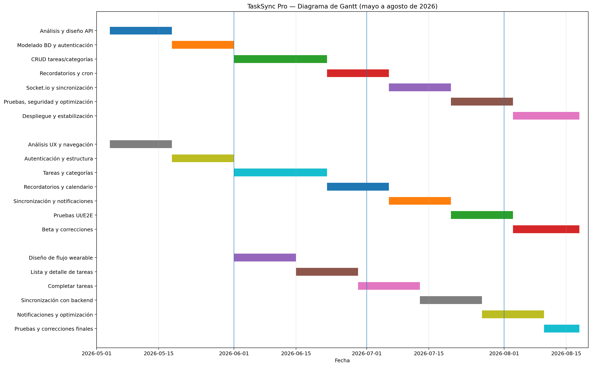


**Diagrama de Gantt en Excel:**

* [Diagrama de Gantt en Excel](images/Gantt_TaskSyncPro.xlsx)

**Datos del Gantt en CSV:**

* [Datos del Gantt en CSV](images/Gantt_TaskSyncPro.csv)


## 10. Gestión de Costos

La estimación de costos del proyecto se realizó considerando los módulos funcionales y los recursos necesarios para su desarrollo.

El modelo utilizado contempla una clasificación de complejidad para estimar las horas de trabajo.

### Método de Estimación

| Complejidad | Horas |
| ----------- | ----- |
| Simple      | 4     |
| Muy fácil   | 8     |
| Fácil       | 16    |
| Normal      | 24    |
| Difícil     | 32    |
| Muy difícil | 40    |

### Cálculo de Horas por Módulo

| Módulo                  | Complejidad asignada | Horas estimadas |
| ----------------------- | -------------------- | --------------- |
| Configurar Backend/API  | Muy fácil            | 8               |
| Diseño Base de Datos    | Muy fácil            | 8               |
| Autenticación JWT       | Fácil                | 16              |
| CRUD de Tareas          | Normal               | 24              |
| Categorías              | Normal               | 24              |
| Calendario              | Difícil              | 32              |
| Recordatorios           | Difícil              | 32              |
| Sincronización Wearable | Muy difícil          | 40              |
| Notificaciones          | Difícil              | 32              |
| Interfaz                | Normal               | 24              |
| Aplicación Wearable     | Muy difícil          | 40              |
| Pruebas e Integración   | Normal               | 24              |

### Totales de Tiempo Estimado

| Concepto         | Valor         |
| ---------------- | ------------- |
| **Total Horas**  | **304 horas** |
| Días (8h/día)    | 38 días       |
| Semanas (5d/sem) | 7.6 semanas   |
| Meses (4sem/mes) | 1.9 meses     |

Estos datos se encuentran documentados en el archivo de estimación de costos.

**Estimación de Costos TaskSync Pro con fórmulas:**

* [Estimacion Costos TaskSyncPro con formulas](images/Estimacion_Costos_TaskSync_Pro_con_formulas.xlsx)

### Desglose de Costos por Categoría

| Categoría           | Concepto                            | Costo (MXN) |
| ------------------- | ----------------------------------- | ----------- |
| **Desarrollo**      | Backend                             | $25,000     |
| **Desarrollo**      | Frontend Web                        | $18,000     |
| **Desarrollo**      | App Móvil                           | $22,000     |
| **Desarrollo**      | Wearable                            | $12,000     |
| **Infraestructura** | Hosting y BD                        | $6,000      |
| **Infraestructura** | Dominio/SSL                         | $1,500      |
| **Herramientas**    | GitHub / herramientas               | $3,000      |
| **QA**              | Pruebas                             | $8,000      |
| **Documentación**   | Manuales                            | $4,000      |
|                     | **Subtotal Desarrollo y Operación** | **$99,500** |

### Recursos Extra (Opcionales)

| Categoría       | Concepto                       | Costo (MXN) |
| --------------- | ------------------------------ | ----------- |
| Marketing       | Publicidad / lanzamiento       | $10,000     |
| Soporte         | Soporte técnico                | $9,000      |
| Diseño          | Diseño UX/UI adicional         | $6,000      |
| Infraestructura | Servidor de pruebas            | $3,000      |
| Herramientas    | Servicios externos             | $4,000      |
| Legal           | Aviso de privacidad / términos | $3,500      |
| Capacitación    | Capacitación al equipo         | $2,500      |
|                 | **Subtotal Recursos Extra**    | **$38,000** |

### Resumen Financiero

| Concepto                    | Costo (MXN)      |
| --------------------------- | ---------------- |
| Desarrollo y Operación      | $99,500          |
| Recursos Extra (opcionales) | $38,000          |
| **Total General**           | **$137,500 MXN** |

> **Nota:** Los valores corresponden a estimaciones de costos del proyecto y no representan necesariamente gastos realizados.

* [Estimacion Costos TaskSyncPro con formulas](images/Estimacion_Costos_TaskSync_Pro_con_formulas.xlsx)

**Fuente de financiamiento:** Autofinanciado por el equipo de desarrollo.

### Estrategia de Reducción de Costos

Dado que el proyecto es autofinanciado, se consideran las siguientes estrategias:

| Área                   | Estrategia                                       |
| ---------------------- | ------------------------------------------------ |
| Infraestructura        | Utilizar servicios gratuitos o de bajo costo     |
| Herramientas           | Utilizar herramientas gratuitas o educativas     |
| Dispositivos de prueba | Utilizar dispositivos propios y emuladores       |
| Documentación          | Utilizar herramientas disponibles para el equipo |
| Desarrollo             | Utilizar software de código abierto o gratuito   |

## 11. Gestión de Adquisiciones

| Ítem                       | Proveedor / Herramienta          | Tipo                  | Nota                      |
| -------------------------- | -------------------------------- | --------------------- | ------------------------- |
| Control de versiones       | GitHub                           | Gratuito              | Administración del código |
| Herramientas de desarrollo | Visual Studio Code               | Gratuito              | Desarrollo del proyecto   |
| Pruebas                    | Postman                          | Gratuito / Disponible | Pruebas del sistema       |
| Base de datos              | MySQL                            | Gratuito / Local      | Almacenamiento            |
| Comunicación               | WhatsApp / Discord / Google Meet | Disponible            | Comunicación del equipo   |
| Documentación              | Google Drive / GitHub            | Disponible            | Organización documental   |

Las adquisiciones se gestionan de acuerdo con las necesidades reales del proyecto, priorizando herramientas gratuitas o disponibles para el equipo.

## 12. Gestión de la Comunicación

Dado que el equipo está conformado por 3 personas, la comunicación se mantiene de manera directa y se complementa con las ceremonias de Scrum.

| Tipo                   | Frecuencia            | Participantes   |
| ---------------------- | --------------------- | --------------- |
| Daily Standup          | Periódica             | Equipo completo |
| Sprint Planning        | Inicio de cada sprint | Equipo completo |
| Sprint Review          | Final de cada sprint  | Equipo completo |
| Sprint Retrospective   | Final de cada sprint  | Equipo completo |
| Informe de avance      | Periódico             | Equipo completo |
| Reunión de seguimiento | Periódica             | Equipo completo |

**Herramientas:**

* WhatsApp.
* Discord.
* Google Meet.
* GitHub.
* Google Drive.

## 13. Gestión de la Calidad

### Estándares Aplicados

* ISO/IEC 25010 como referencia para la calidad del software.

### Actividades de Calidad

* Revisiones del código.
* Pruebas funcionales.
* Pruebas de integración.
* Validación de datos.
* Revisión de autenticación.
* Revisión de funcionalidades.
* Corrección de errores.
* Revisión de documentación.
* Validación de la sincronización.
* Pruebas de usabilidad.

### Aspectos Evaluados

* Funcionalidad.
* Seguridad.
* Compatibilidad.
* Usabilidad.
* Mantenibilidad.
* Fiabilidad.
* Rendimiento.

La calidad se revisa durante las diferentes etapas del proyecto para detectar errores y realizar las correcciones necesarias.

## 14. Gestión de Riesgos

| Riesgo                          | Probabilidad | Impacto | Mitigación                                |
| ------------------------------- | ------------ | ------- | ----------------------------------------- |
| Retrasos en desarrollo          | Alta         | Alto    | Priorización de actividades y seguimiento |
| Problemas de sincronización     | Media        | Alto    | Pruebas de integración                    |
| Errores en recordatorios        | Media        | Alto    | Pruebas y validación                      |
| Cambios en requisitos           | Media        | Medio   | Control de cambios y revisión del backlog |
| Problemas de integración        | Media        | Alto    | Integración progresiva                    |
| Errores en base de datos        | Media        | Alto    | Validación y pruebas                      |
| Sobrecarga de trabajo           | Alta         | Alto    | Distribución de actividades               |
| Dependencia tecnológica         | Media        | Medio   | Investigación y alternativas              |
| Falta de tiempo                 | Alta         | Alto    | Priorización de funcionalidades           |
| Problemas durante el despliegue | Media        | Medio   | Pruebas y estabilización                  |

Los riesgos se revisan durante el desarrollo y pueden actualizarse conforme se identifican nuevos problemas o cambios en el proyecto.

## 15. Plan de Pruebas

### Tipos de Pruebas

1. **Pruebas Funcionales:** Verificación de las funcionalidades principales del sistema.
2. **Pruebas de Integración:** Verificación de la comunicación entre los diferentes componentes.
3. **Pruebas de Interfaz:** Verificación de navegación, visualización y funcionamiento de las interfaces.
4. **Pruebas de Sincronización:** Verificación de la actualización de información entre los componentes.
5. **Pruebas de Seguridad:** Verificación de autenticación, contraseñas, JWT y validación de datos.
6. **Pruebas de Compatibilidad:** Verificación del funcionamiento en los dispositivos y entornos disponibles para el proyecto.

### Funcionalidades a Probar

* Registro de usuarios.
* Inicio de sesión.
* Creación de tareas.
* Consulta de tareas.
* Edición de tareas.
* Eliminación de tareas.
* Categorías.
* Fechas.
* Horarios.
* Recordatorios.
* Recurrencias.
* Cambio de estados.
* Calendario.
* Sincronización.
* Actualización desde el wearable.

### Herramientas

* Postman.
* Navegadores.
* Emuladores.
* Dispositivos disponibles para el equipo.

### Criterios de Aprobación

* Las funcionalidades cumplen con los requisitos definidos.
* Los datos se almacenan correctamente.
* Las operaciones funcionan de acuerdo con lo esperado.
* Las validaciones funcionan correctamente.
* Los errores son controlados.
* La información permanece consistente.
* Las funcionalidades críticas no presentan errores que impidan su utilización.

## 16. Información del Cierre del Proyecto

**Fecha Estimada de Cierre:** 17 de agosto de 2026

### Criterios de Cierre

* Funcionalidades principales desarrolladas.
* Pruebas correspondientes realizadas.
* Errores identificados atendidos.
* Documentación organizada.
* Entregables disponibles.
* Lecciones aprendidas documentadas.
* Revisión final realizada por el equipo.

### Actividades de Cierre

* Revisión final del proyecto.
* Corrección de errores pendientes.
* Ejecución de pruebas finales.
* Revisión de documentación.
* Organización de entregables.
* Actualización del repositorio.
* Elaboración de conclusiones.
* Registro de lecciones aprendidas.
* Cierre administrativo del proyecto.

La publicación comercial en App Store o Google Play no forma parte de los criterios obligatorios de cierre del proyecto.

## Colaboradores del Proyecto

El desarrollo de **TaskSync Pro** fue posible gracias al trabajo colaborativo del equipo de desarrollo, quienes participaron en las diferentes etapas del proyecto, desde la planeación y diseño hasta la implementación, pruebas y documentación.

| Integrante                         | Rol Principal                              | Responsabilidades                                                                                                         |
| ---------------------------------- | ------------------------------------------ | ------------------------------------------------------------------------------------------------------------------------- |
| Carlos Isaac Fosado Escudero       | Desarrollador Frontend Mobile              | Desarrollo de la aplicación móvil, interfaz de usuario, gestión de tareas, calendario, categorías, perfil y documentación |
| Diego Salvador Tecorralco Martínez | Líder del Proyecto / Desarrollador Backend | Planeación, arquitectura, desarrollo, base de datos, autenticación, coordinación general y documentación                  |
| Ailton Artiaga Quiroga             | Desarrollador Full Stack / Wearable        | Participación en el componente wearable, integración y apoyo en desarrollo                                                |

**Fecha Estimada de Cierre:** 17 de agosto de 2026

## Conclusión General

TaskSync Pro es un proyecto de desarrollo de software orientado a la gestión y organización de tareas personales y profesionales.

El sistema contempla la administración de tareas, categorías, fechas, horarios, recordatorios, recurrencias y estados, además de la consulta y actualización de tareas mediante un dispositivo wearable.

El desarrollo del proyecto utiliza la metodología ágil **Scrum**, permitiendo organizar las actividades mediante iteraciones, planificación, seguimiento, revisión y mejora continua.

El proyecto cuenta con una planificación que comprende el periodo del **4 de mayo de 2026 al 17 de agosto de 2026**, incluyendo actividades de análisis, diseño, desarrollo, integración, pruebas, correcciones y estabilización.

La documentación del proyecto contempla la gestión del alcance, recursos humanos, interesados, tiempo, costos, adquisiciones, comunicación, calidad, riesgos, control de cambios, pruebas y cierre.

El proyecto se encuentra orientado a cumplir con los objetivos establecidos y mantener una documentación organizada que permita dar seguimiento al desarrollo y a los resultados obtenidos.

## 17. Resultados Finales

### 17.1 API

**API Funcional**
aqui esta una captura de nuestra API Funcional, con logs de Morgan.

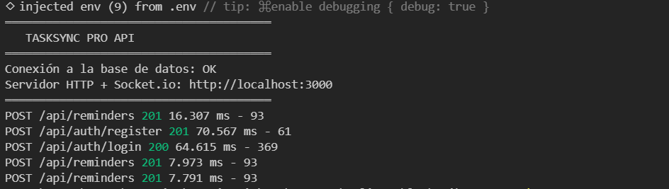

**Ejemplo de api con Socket.io implementado**
aquí esta una captura de pantalla de la prueba sencilla que hice para ver si la api aceptaba el Socket.io.

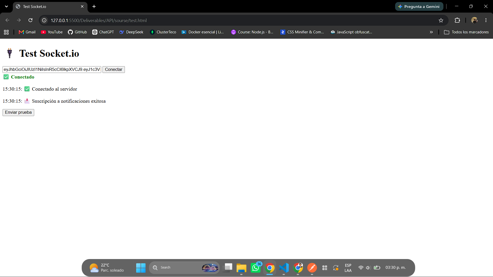

**Estructura de la API** 
Aqui se encuentra una captura de de toda la estructura de la API.

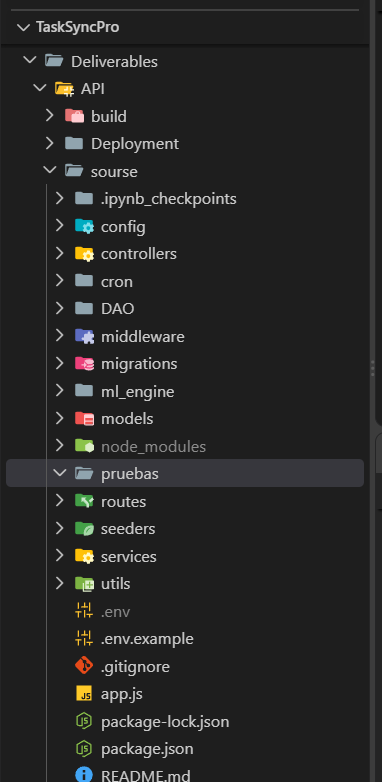

**Pruebas en postman del proyecto**
Aqui esta una captura donde se muestra una peticion exitosa y del lado izquierdo todas las rutas donde hice las pruebas.

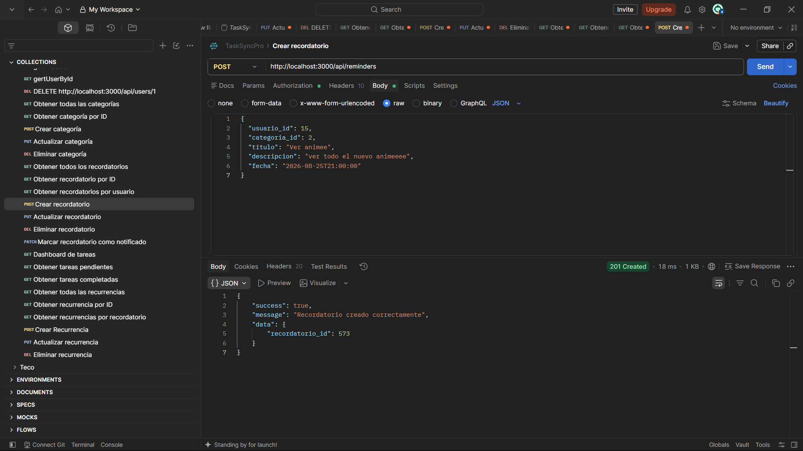

### 17.2 Werable

**Dashboard**
Aqui está una captura de pantalla del Dashboard de mi Werable.

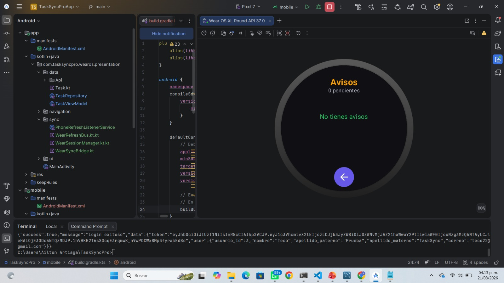

**Tareas**
Aquí está una captura de la sección de tareas en la app werable.

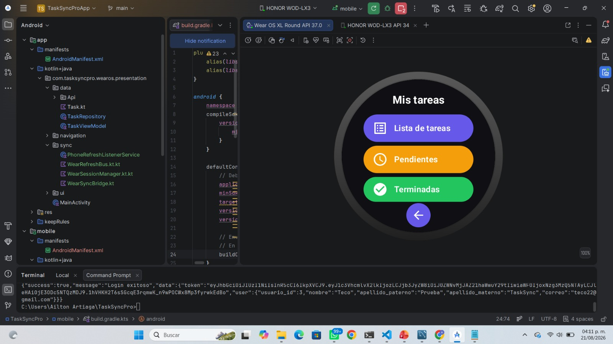

**Avisos Werable**
Una captura de el apartado de avisos.


**Calendario Werable**
Aquí esta el apartado del calendario en el Werable.

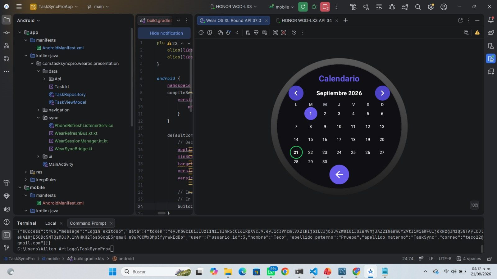

### 17.3 Aplicación móvil

**Dashboard Móvil**
Captura de pantalla de el Dashboard Móvil.

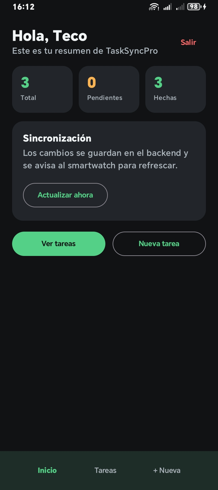

**Tareas Móvil**
Captura de pantalla de el apartado de tareas en móvil.

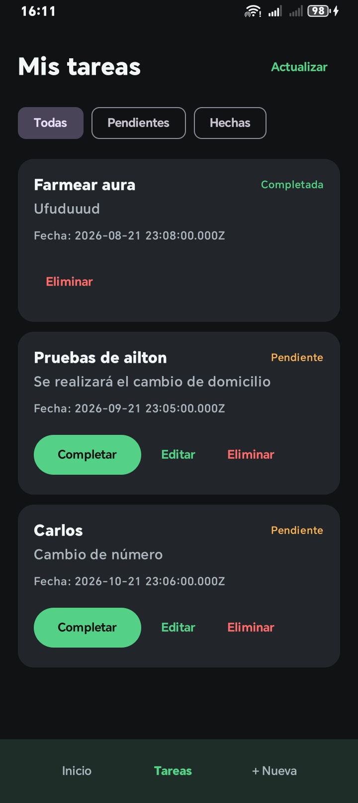

**Creación de nueva tarea Móvil**
Captura de pantalla de el apartado donde se crea una nueva tarea en el celular.

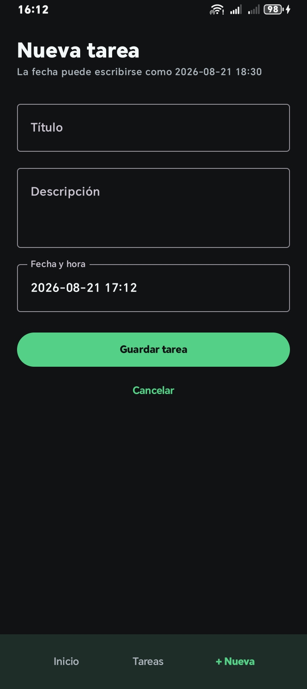

## 18. Presentacion del Proyecto

Aquí se encuentra nuestra presentación que presentamos para exponer nuestro proyecto.

[Presentación en PowerPoint de TaskSyncPro](./images/TaskSyncPro_Presentacion_9B.pptx)